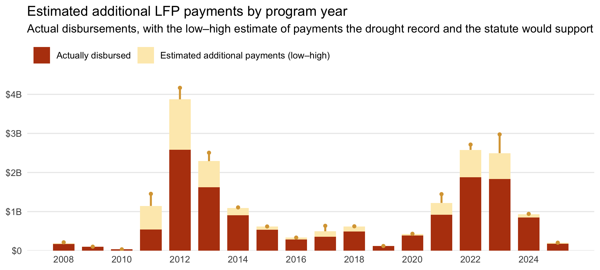

<!-- README.md is generated from README.Rmd. Please edit that file -->

[](https://github.com/sustainable-fsa/fsa-lfp-payments-derived/)


# FSA Livestock Forage Disaster Program Payments, Derived

This repository estimates how much the USDA [Livestock Forage Disaster
Program
(LFP)](https://www.fsa.usda.gov/resources/programs/livestock-forage-disaster-program-lfp)
would have paid, program years 2008–2025, had three identifiable data
issues in its county eligibility determinations not been present:

1.  **Non-authoritative county boundaries** (Type 1). The county cut of
    the US Drought Monitor is performed by the National Drought
    Mitigation Center (NDMC) under contract to USDA, on a county
    boundary dataset the NDMC adopted before the 2008 Farm Bill and has
    revised only three times since.
2.  **A percent-of-county coverage threshold** (Type 2). The county
    classification the NDMC reports appears to require a minimum share
    of the county to be in drought before the class is assigned — a
    stricter standard than the statute’s trigger on drought “in any area
    of the county” (7 U.S.C. § 1531(d)(3)).
3.  **An undocumented cap on eligible payment months** (Type 3). The
    months paid appear to be capped at the whole-month floor of the
    county’s normal grazing period rather than scaled to drought
    intensity, a rule that appears in no handbook, notice, statute, or
    Federal Register rule.

For every Census county, FSA county, program year and pasture type, the
archive carries the monthly payments earned under each of four USDM
county-aggregation conventions alongside the months FSA actually paid,
attributes each discrepancy to at most one of the three issues, and
scales each county-year’s actual LFP disbursement by the ratio of months
warranted to months paid. Summed across the program, the three issues
account for an estimated \$5.0 billion–\$6.8 billion in foregone
payments against \$13.8 billion actually disbursed.

<a href="https://data.sustainable-fsa.com/fsa-lfp-payments-derived/" target="_blank">📂
View the LFP payments archive listing here.</a>

> **Note**: These are **estimates with stated assumptions, not an
> accounting of money owed**. The archive is derived from the project’s
> [eligibility
> reanalysis](https://sustainable-fsa.com/fsa-lfp-eligibility-derived/),
> FSA’s [FOIA-obtained
> determinations](https://sustainable-fsa.com/fsa-lfp-eligibility/) and
> the [Farm Payment
> Files](https://sustainable-fsa.com/fsa-payment-files/); it is not a
> record of USDA’s determinations or payments, and it is not evidence of
> any producer’s entitlement. The analysis was first presented in the
> project briefing *What Drifted Eligibility Data Costs* (July 2026).

------------------------------------------------------------------------

## 🗂️ Contents

- [`fsa-lfp-payments-derived.csv`](https://data.sustainable-fsa.com/fsa-lfp-payments-derived/fsa-lfp-payments-derived.csv)
  — one record per county pair, program year and pasture type: months
  earned under each aggregation, months FSA paid, the discrepancy type
  and the payment ratios
- [`fsa-lfp-payments-derived.parquet`](https://data.sustainable-fsa.com/fsa-lfp-payments-derived/fsa-lfp-payments-derived.parquet)
  — the same records as Parquet
- [`fsa-lfp-payments-derived-county-years.csv`](https://data.sustainable-fsa.com/fsa-lfp-payments-derived/fsa-lfp-payments-derived-county-years.csv)
  /
  [`.parquet`](https://data.sustainable-fsa.com/fsa-lfp-payments-derived/fsa-lfp-payments-derived-county-years.parquet)
  — actual and estimated additional disbursements per FSA county,
  program year and scenario
- [`fsa-lfp-payments-derived-annual.csv`](https://data.sustainable-fsa.com/fsa-lfp-payments-derived/fsa-lfp-payments-derived-annual.csv)
  /
  [`.parquet`](https://data.sustainable-fsa.com/fsa-lfp-payments-derived/fsa-lfp-payments-derived-annual.parquet)
  — national totals per program year and scenario
- [`fsa-lfp-payments-derived.json`](https://data.sustainable-fsa.com/fsa-lfp-payments-derived/fsa-lfp-payments-derived.json)
  — the three tables restructured for browsers (see *Output Data*)
- [`provenance.json`](https://data.sustainable-fsa.com/fsa-lfp-payments-derived/provenance.json)
  — the inputs read (URL, ETag, last-modified, rows) and the headline
  totals
- [`qa-report.txt`](https://data.sustainable-fsa.com/fsa-lfp-payments-derived/qa-report.txt)
  — validation summary, record counts by discrepancy type, and every
  record the attribution or the county join could not place
- [`fsa-lfp-payments-derived.R`](./fsa-lfp-payments-derived.R) —
  processing script
- [`_manifest.txt`](https://data.sustainable-fsa.com/fsa-lfp-payments-derived/_manifest.txt)
  — flat index of every file in the S3-hosted mirror

------------------------------------------------------------------------

## ☁️ Archive Hosting & Automated Publishing

Every output is mirrored to S3 and served via CloudFront at
<https://data.sustainable-fsa.com/fsa-lfp-payments-derived/> (browse the
[archive
listing](https://data.sustainable-fsa.com/fsa-lfp-payments-derived/) or
[`_manifest.txt`](https://data.sustainable-fsa.com/fsa-lfp-payments-derived/_manifest.txt)
for a flat index). The tables are small, so all of them are **also
committed to this repository**: the archive is readable from a git
checkout alone and its history is inspectable commit by commit.

Publishing is handled by
[`fsa-lfp-payments-derived.R`](./fsa-lfp-payments-derived.R) via the
shared [`R/s3-archive.R`](R/s3-archive.R) helpers, and runs in GitHub
Actions
([`.github/workflows/fsa-lfp-payments-derived.yaml`](.github/workflows/fsa-lfp-payments-derived.yaml)).
It is dispatched each week once the upstream [eligibility
reanalysis](https://sustainable-fsa.com/fsa-lfp-eligibility-derived/)
has published, with a cron fallback. A precheck compares the ETags of
the three upstream inputs against those recorded in the published
`provenance.json` and skips the run when nothing has changed. The
workflow authenticates to AWS via GitHub OIDC, re-renders this README
from the freshly written tables, and commits the outputs back to git
only if they changed.

The months columns can move weekly as the reanalysis extends; the dollar
columns move only when the Farm Payment Files archive is refreshed,
which happens about once a year.

------------------------------------------------------------------------

## 📥 Input Data

Everything is read over HTTPS from companion archives in this
organization. No FOIA workbook or payment file is read directly.

| Archive | What this archive takes from it |
|----|----|
| [`fsa-lfp-eligibility-derived`](https://sustainable-fsa.com/fsa-lfp-eligibility-derived/) | Months earned per county pair, program year and pasture type under four USDM county aggregations: `usdm-counties` (Census boundaries, vintage-matched to each USDM week), `usdm-counties-census-2020` (Census 2020 boundaries held fixed), `usdm-counties-fsa-lfp` (the FSA/NDMC boundary file), and `usdm-counties-reported` (the county classes the NDMC itself reports) |
| [`fsa-lfp-eligibility`](https://sustainable-fsa.com/fsa-lfp-eligibility/) | FSA’s own determinations, obtained by FOIA: `Drought Factor`, `Maximum Eligible Payment Months`, and `Payment Factor`, the payable months |
| [`fsa-normal-grazing-period`](https://sustainable-fsa.com/fsa-normal-grazing-period/) | The normal grazing period per FSA county, program year and pasture type, which defines the universe of determinations and the grazing-period length the cap test uses |
| [`fsa-counties-dd22`](https://sustainable-fsa.com/fsa-counties-dd22/) | The FSA county to Census county crosswalk |
| [`fsa-payment-files`](https://sustainable-fsa.com/fsa-payment-files/) | Actual LFP disbursements, summed to FSA county and program year over the three LFP accounting programs |

The Farm Payment Files are read with DuckDB straight off the archive’s
`_manifest.txt`, the access pattern documented in that archive’s README.
Only the hive partitions for the program years in scope are fetched.

### Program years in scope

The years covered are those FSA has determined — currently 2008–2025,
taken from the FOIA archive at run time. The reanalysis runs a year
ahead, computing the current season weekly; those rows have nothing to
be compared against and are held back until the FOIA archive catches up.
Payments for the latest program year are still being disbursed when the
payment files are compiled, so that year’s dollar estimates are partial.

------------------------------------------------------------------------

## 🧹 Processing Workflow

The processing script
[`fsa-lfp-payments-derived.R`](./fsa-lfp-payments-derived.R):

1.  **Reads FSA’s determinations**, drops fire eligibility (which
    carries no payment factor), and fixes the program years in scope.
2.  **Reduces the reanalysis to months**: the highest drought factor per
    Census county, FSA county, aggregation, program year and pasture
    type.
3.  **Builds the universe** of determinations from the normal grazing
    periods mapped onto Census counties through the dd22 crosswalk,
    keeping both county keys (see *Two county keys* below).
4.  **Sums LFP disbursements** to FSA county and program year.
5.  **Assembles the records**, zero-filling months where an aggregation
    earned nothing and where FSA listed no eligibility, and
    **attributes** each record to at most one issue.
6.  **Computes payment ratios** and, per FSA county-year and scenario,
    the smallest and largest ratio among the affected records, then
    scales that county-year’s disbursement by each.
7.  **Sums to program years** per scenario.
8.  **Validates** the result and writes the QA report.
9.  **Exports** the three tables as CSV and Parquet, the browser JSON,
    and `provenance.json`, and publishes to S3.

------------------------------------------------------------------------

## 🔎 Attributing discrepancies

Comparing the months earned under three of the aggregations against the
months FSA paid isolates each issue, because each leaves a distinct
signature. Let *C* be the months under Census boundaries, *F* the months
under the FSA/NDMC boundary file, *R* the months under the classes the
NDMC reported, and *P* the months FSA paid (`FSA Payment Factor`).

| `Discrepancy Type` | Condition | Reading |
|----|----|----|
| `Type 1` | *C* ≠ *F* and *F* = *R* = *P* | Only the boundary file changes the class: boundary geometry alone |
| `Type 2` | *F* ≠ *R* and *R* = *P* | The reported class departs from a recomputation on the NDMC’s own boundaries: the coverage threshold |
| `Type 3` | *F* = *R* and *R* ≠ *P* | The drought record and the determination agree on the class but not on the months paid |
| `Multiple` | *C* ≠ *P*, none of the above | The authoritative recomputation and the determination differ, but no single issue accounts for it |
| `None` | otherwise | Agreement |

The conditions are evaluated in order and a record takes the first that
holds. Type 3 records are further split by `Discrepancy Subtype`:

| `Discrepancy Subtype` | Condition |
|----|----|
| `Not determined` | *P* = 0: the drought record supports eligibility, FSA listed none |
| `Overpaid` | *P* \> *R* |
| `Cap-consistent` | *P* \< *R* and the grazing period is shorter than *P* + 1 months: the months paid equal the whole-month floor of the grazing period |
| `Unexplained` | *P* \< *R* and the grazing period is long enough to carry more months |

Grazing-period length is days ÷ 30, the convention the briefing used.

### Payment ratios

`Discrepancy Payment Ratio` is the months warranted under the issue’s
own comparison divided by the months paid: *C*/*P* for Type 1, *F*/*P*
for Type 2, *R*/*P* for Type 3, exactly 1 for `None`, and missing for
`Multiple`. `Census Payment Ratio` is *C*/*P* for every record, whatever
the type: the all-in comparison that bypasses attribution.

A ratio is **missing where either side is zero**. With *P* = 0 there is
no disbursement to scale; with the warranted months at zero the ratio
would claim a full clawback, which this archive does not estimate. Such
records are classified, counted in `qa-report.txt`, and contribute no
dollars. Because they are excluded, the dollar estimates are
conservative in one specific way: a county FSA never listed as eligible
contributes nothing even where the drought record supports payment.

The comparison is on FSA’s `Payment Factor`, never its `Drought Factor`.
`Payment Factor` is the payable figure,
`min(Drought Factor, Maximum Eligible Payment Months)`; comparing on it
is what makes the cap visible as Type 3.

### From months to dollars

The payment files record disbursements by FSA county and program year,
with no breakdown by pasture type or Census county. Each affected
county-year’s actual disbursement is therefore scaled by the ratio of
months warranted to months paid, and because an FSA office carries
several pasture types and may cover several Census counties, each with
its own ratio, the **smallest and largest ratio among the affected
records bracket the estimate** instead of resolving it to a point:

> additional disbursement = (ratio − 1) × actual disbursement

for the minimum and the maximum ratio in turn. Scaling assumes the same
producers and acreage would have enrolled at the higher factor, which is
the natural reading but not a certainty. All amounts are nominal,
unadjusted for inflation.

------------------------------------------------------------------------

## 📤 Output Data

Prefer the Parquet where you can. It carries types, so `FIPS` and
`FSA County` come back as character and the discrepancy columns as
factors. The CSV carries none, and base R’s `read.csv()` and pandas will
read the county codes as integers and drop the leading zero, turning
Autauga County, AL (`01001`) into `1001`. Read them as character
explicitly:

``` r
readr::read_csv(
  "https://data.sustainable-fsa.com/fsa-lfp-payments-derived/fsa-lfp-payments-derived.csv",
  col_types = readr::cols(FIPS = "c", `FSA County` = "c")
)
```

### `fsa-lfp-payments-derived.csv` and `.parquet`

One record per **Census county, FSA county, program year and pasture
type**.

| Variable | Description |
|----|----|
| `FIPS` | Census county (5-digit state + county ANSI/FIPS code) |
| `FSA County` | FSA county (5-digit FSA state + county code) |
| `Program Year` | LFP program year |
| `Pasture Type` | Grazing land or pastureland type, as FSA classifies it |
| `usdm-counties` | Monthly payments earned on Census boundaries, vintage-matched to each USDM week (*C*) |
| `usdm-counties-census-2020` | Monthly payments earned on Census 2020 boundaries held fixed; carried for reference, drives no scenario |
| `usdm-counties-fsa-lfp` | Monthly payments earned on the FSA/NDMC LFP boundary file (*F*) |
| `usdm-counties-reported` | Monthly payments earned on the county classes the NDMC reported (*R*) |
| `FSA Drought Factor` | The drought factor FSA reported; missing where FSA listed no eligibility |
| `FSA Maximum Eligible Payment Months` | FSA’s cap; missing where FSA listed no eligibility and for 2008–2011, which the FOIA response did not carry |
| `FSA Payment Factor` | Monthly payments FSA paid (*P*); 0 where FSA listed no eligibility |
| `Grazing Months` | Length of the normal grazing period in months (days ÷ 30) |
| `Discrepancy Type` | `None`, `Type 1`, `Type 2`, `Type 3`, or `Multiple`; missing where no grazing period is published |
| `Discrepancy Subtype` | For Type 3 only: `Overpaid`, `Cap-consistent`, `Unexplained`, or `Not determined` |
| `Discrepancy Payment Ratio` | Months warranted under the attributed issue ÷ months paid (see above) |
| `Census Payment Ratio` | *C* ÷ *P*, every record |

A handful of FSA determinations have no published normal grazing period.
They are kept with their FSA columns filled, every other value missing,
and no discrepancy type; `qa-report.txt` enumerates them.

### `fsa-lfp-payments-derived-county-years.csv` and `.parquet`

One row per **FSA county, program year and scenario**, for county-years
with at least one affected record.

| Variable | Description |
|----|----|
| `FSA County` | FSA county (5-digit FSA state + county code) |
| `Program Year` | LFP program year |
| `Scenario` | `Boundary (Type 1)`, `Threshold (Type 2)`, `Payment Months (Type 3)`, or `All Issues (Census)` |
| `Records` | Records in the county-year attributed to the scenario |
| `Disbursement Amount` | Actual LFP disbursements to the FSA county that program year, in nominal dollars; missing where the payment files record none |
| `Minimum Payment Ratio` | Smallest ratio among the affected records |
| `Maximum Payment Ratio` | Largest ratio among the affected records |
| `Minimum Additional Disbursement` | (`Minimum Payment Ratio` − 1) × `Disbursement Amount` |
| `Maximum Additional Disbursement` | (`Maximum Payment Ratio` − 1) × `Disbursement Amount` |

The first three scenarios use `Discrepancy Payment Ratio` on records of
that type. `All Issues (Census)` uses `Census Payment Ratio` on every
record where it differs from 1, whatever the type.

### `fsa-lfp-payments-derived-annual.csv` and `.parquet`

One row per **program year and scenario**, every year in scope.

| Variable | Description |
|----|----|
| `Program Year` | LFP program year |
| `Scenario` | The four scenarios above, plus `All Issues (Sum of Types)`: the three attributed scenarios added together, a county-year touched by more than one counted once |
| `Disbursement Amount` | Total LFP disbursed that program year, all counties |
| `County Years` | FSA county-years affected |
| `Minimum Additional Disbursement` | Sum of the county-year minimums |
| `Maximum Additional Disbursement` | Sum of the county-year maximums |

`All Issues (Sum of Types)` and `All Issues (Census)` estimate the same
quantity two ways — by attribution and by direct recomputation — and
should agree closely. Their difference is a check on the attribution.

### `fsa-lfp-payments-derived.json`

The same three tables restructured for direct use in a browser, in the
layout of the LFP eligibility archives’ payload: **column-oriented**
(one array per field), **dictionary-coded** (pasture types, FSA county
codes and FIPS codes appear once in lookup arrays; the record arrays
hold 0-based indices into them), and sorted on the integer index columns
so the file gzips well. It is a display format, not an archive-of-record
format; for analysis, use the CSV or Parquet.

The payload is self-describing via its `schema` field
(`fsa-lfp-payments-derived/1`), a frozen contract: fields may be added,
but existing ones are never renamed or reordered without bumping the
schema.

| Key | Contents |
|----|----|
| `schema`, `dataset`, `license` | `fsa-lfp-payments-derived/1`, `fsa-lfp-payments-derived`, `CC0-1.0` |
| `year0`, `years` | The first program year (years are stored as offsets from it) and the range |
| `types`, `counties`, `fips_codes` | Dictionaries for pasture type, FSA county and Census county |
| `discrepancy_types`, `discrepancy_subtypes`, `scenarios` | Dictionaries for the classification columns, in the fixed order the tables use |
| `records` | `n`; `type`, `county`, `fips` (indices); `year` (offset); `m_census`, `m_census2020`, `m_lfp`, `m_reported` (months per aggregation); `m_paid` (`FSA Payment Factor`); `m_cap` (`FSA Maximum Eligible Payment Months`); `gm` (`Grazing Months`, 2 dp); `disc`, `sub` (indices); `r_disc`, `r_census` |
| `county_years` | `n`; `county`, `year`, `scenario`; `k` (`Records`); `paid`; `rmin`, `rmax`; `lo`, `hi` |
| `annual` | `n`; `year`, `scenario`; `paid`; `k` (`County Years`); `lo`, `hi` |

Nulls appear only where the tables have them: `m_*` and `disc` on
records with no published grazing period, `m_cap` where FSA reported
none, `sub` outside Type 3, `r_disc` and `r_census` where a ratio is
undefined, and `paid`, `lo`, `hi` where a county-year has no recorded
disbursement. Dollars are in cents precision; ratios are exact.

------------------------------------------------------------------------

## 🗺️ Two county keys

An LFP determination needs two counties. The normal grazing period is
set per **FSA county**, the administrative unit; eligibility triggers on
drought “in any area of the county” as a **Census county**, the unit the
US Drought Monitor is aggregated to. The two do not nest in either
direction — one FSA office may cover several Census counties, and
several offices may split one — so the records table carries the pair
unreduced, as the eligibility reanalysis does.

Disbursements are recorded per FSA county, so **dollars are estimated at
FSA county grain**. Every Census county an office covers contributes its
ratio to that office’s minimum and maximum, and a Census county
administered by several offices contributes to each office’s own
disbursement separately, so nothing is double counted. The `Records`
column says how many records bracket each county-year.

------------------------------------------------------------------------

## 📍 Quick Start: Chart the estimated shortfall in R

This README is rendered by the weekly build, so the example reads the
Parquet file that build just produced. To run it yourself, substitute
the published URL
<https://data.sustainable-fsa.com/fsa-lfp-payments-derived/fsa-lfp-payments-derived-annual.parquet>
— `arrow::read_parquet()` takes it directly.

``` r
library(dplyr)
library(ggplot2)
library(tidyr)

annual <- arrow::read_parquet("fsa-lfp-payments-derived-annual.parquet") |>
  filter(Scenario == "All Issues (Sum of Types)")

paid <- annual |>
  transmute(`Program Year`,
            Additional = `Minimum Additional Disbursement`,
            Paid = `Disbursement Amount`) |>
  pivot_longer(-`Program Year`, names_to = "part", values_to = "amount") |>
  mutate(part = factor(part, levels = c("Additional", "Paid")))

ggplot() +
  geom_col(data = paid, aes(`Program Year`, amount / 1e9, fill = part),
           width = 0.74) +
  geom_linerange(
    data = annual,
    aes(x = `Program Year`,
        ymin = (`Disbursement Amount` + `Minimum Additional Disbursement`) / 1e9,
        ymax = (`Disbursement Amount` + `Maximum Additional Disbursement`) / 1e9),
    colour = "#D9A441", linewidth = 0.9
  ) +
  geom_point(
    data = annual,
    aes(x = `Program Year`,
        y = (`Disbursement Amount` + `Maximum Additional Disbursement`) / 1e9),
    colour = "#D9A441", size = 1.2
  ) +
  scale_fill_manual(
    values = c(Paid = "#B7410E", Additional = "#fdebbb"),
    labels = c(Paid = "Actually disbursed",
               Additional = "Estimated additional payments (low–high)"),
    breaks = c("Paid", "Additional"), name = NULL
  ) +
  scale_x_continuous(breaks = seq(min(annual$`Program Year`),
                                  max(annual$`Program Year`), 2),
                     minor_breaks = NULL) +
  scale_y_continuous(labels = \(x) ifelse(x == 0, "$0", paste0("$", x, "B")),
                     expand = expansion(mult = c(0, 0.04))) +
  labs(
    x = NULL, y = NULL,
    title = "Estimated additional LFP payments by program year",
    subtitle = "Actual disbursements, with the low–high estimate of payments the drought record and the statute would support"
  ) +
  theme_minimal(base_size = 11) +
  theme(legend.position = "top", legend.justification = "left",
        panel.grid.major.x = element_blank(), panel.grid.minor = element_blank())
```



------------------------------------------------------------------------

## 🧭 Related archives

- [fsa-lfp-eligibility](https://sustainable-fsa.com/fsa-lfp-eligibility/)
  — FSA’s determinations as obtained by FOIA, program years 2008–2025
- [fsa-lfp-eligibility-derived](https://sustainable-fsa.com/fsa-lfp-eligibility-derived/)
  — eligibility recomputed from the US Drought Monitor under four county
  aggregations; the months columns here come from it
- [fsa-payment-files](https://sustainable-fsa.com/fsa-payment-files/) —
  the Farm Payment Files, 2004–present; the dollars here come from it
- [fsa-normal-grazing-period](https://sustainable-fsa.com/fsa-normal-grazing-period/)
  — the normal grazing periods that define the universe of
  determinations

------------------------------------------------------------------------

## 📝 Citation

If you use this data in published work, please cite:

> Bocinsky, R. Kyle. *Livestock Forage Disaster Program Payments,
> 2008–2025: Foregone Payments Derived from County Eligibility
> Discrepancies*. Montana Climate Office, University of Montana.
> Sustainable FSA project. Accessed YYYY-MM-DD.
> <https://data.sustainable-fsa.com/fsa-lfp-payments-derived/>

Machine-readable metadata are in [`CITATION.cff`](CITATION.cff);
GitHub’s **Cite this repository** button (top right of the repo page)
renders it as APA or BibTeX.

The underlying data this archive reads should be cited separately — the
eligibility reanalysis, the FOIA determinations, the normal grazing
periods and the Farm Payment Files each have their own archive and
citation.

**Acknowledgment**: This work is part of the [*Enhancing Sustainable
Disaster Relief in FSA
Programs*](https://www.ars.usda.gov/research/project/?accnNo=444612)
project, supported by the USDA Office of the Chief Economist, Office of
Energy and Environmental Policy, and the USDA Climate Hubs.

## 📄 License

- **Raw USDM data** (NDMC), **raw FOIA data** and **Farm Payment Files**
  (USDA): Public Domain (17 USC § 105)
- **Processed data & scripts**: © R. Kyle Bocinsky, released under
  [CC0](https://creativecommons.org/publicdomain/zero/1.0/) and [MIT
  License](./LICENSE) as applicable

------------------------------------------------------------------------

## ⚠️ Disclaimer

This dataset is archived for research and educational use only. It is an
estimate derived from other archives, not a record of USDA’s
determinations or payments, and it is not evidence of any producer’s
eligibility for, or entitlement under, any program. It may not reflect
current USDA administrative boundaries or official LFP policy. Always
consult your **local FSA office** for the latest program guidance.

To locate your nearest USDA Farm Service Agency office, use the USDA
Service Center Locator:

🔗 [**USDA Service Center
Locator**](https://offices.sc.egov.usda.gov/locator/app)

------------------------------------------------------------------------

## 👏 Acknowledgment

This project is part of:

**[*Enhancing Sustainable Disaster Relief in FSA
Programs*](https://www.ars.usda.gov/research/project/?accnNo=444612)**
Supported by USDA OCE/OEEP and USDA Climate Hubs Prepared by the
[Montana Climate Office](https://climate.umt.edu)

------------------------------------------------------------------------

## ✉️ Contact

**R. Kyle Bocinsky** Director of Climate Extension Montana Climate
Office 📧 <kyle.bocinsky@umontana.edu> 🌐 <https://climate.umt.edu>
